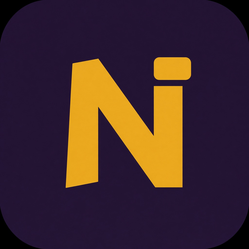
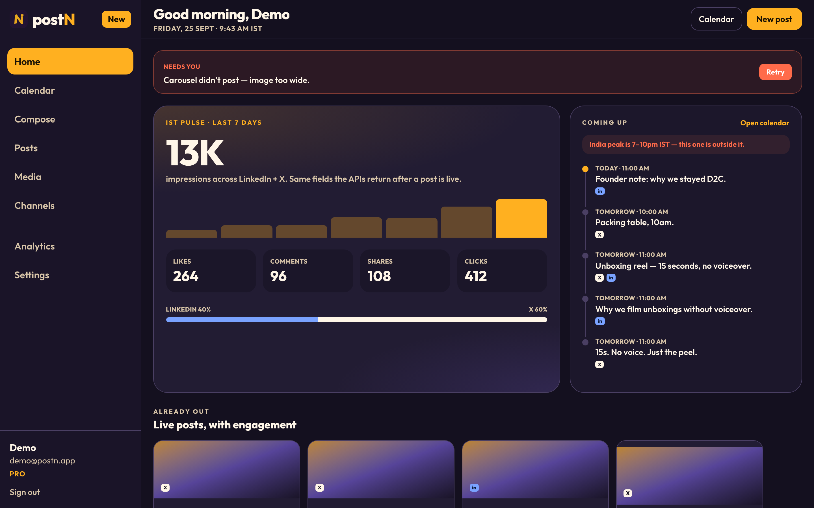
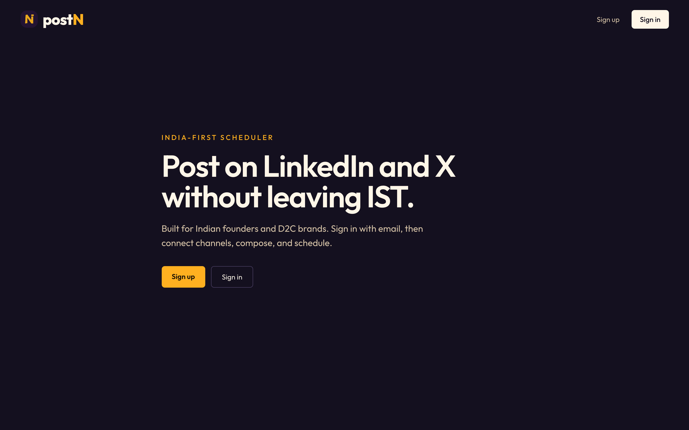
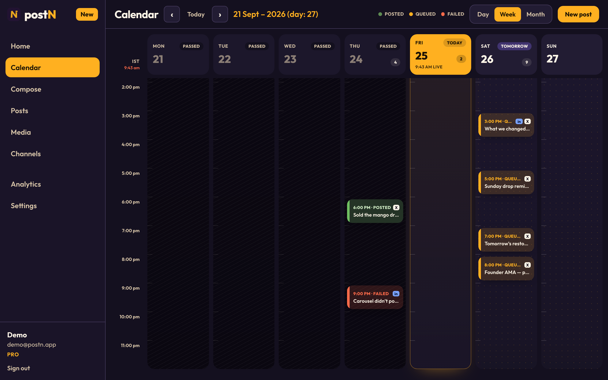
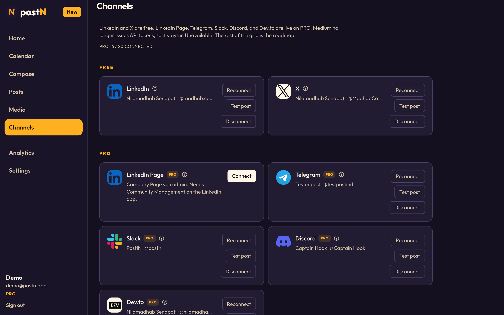
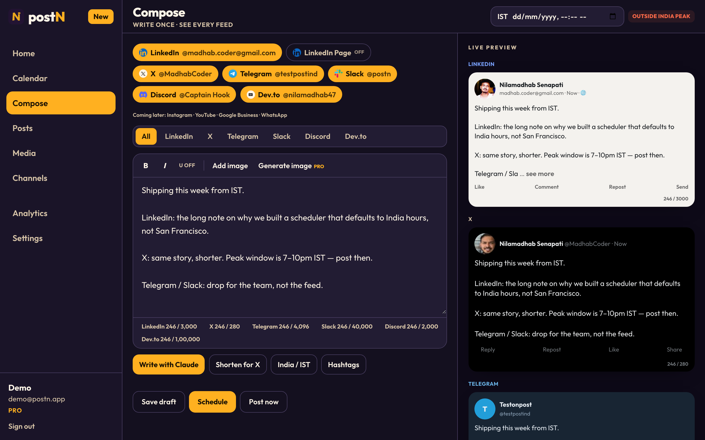

<p align="center">
  
</p>

<h1 align="center">postN</h1>

<p align="center">
  India-first social scheduler for founders and D2C brands.<br />
  Write once. Post to LinkedIn, X, Telegram, Slack, Discord, and Dev.to — on IST hours.
</p>

<p align="center">
  
</p>

## What it is

postN is a dark, IST-native scheduler. After login you land on **Home** (the pulse), not a calendar dump. **Calendar** is a time board with hour rows and a 7–10pm India peak. **Channels** is a live connect grid. **Compose** shows each network as it will look.

POC is done: email/password login, live channel connect, drafts, Post now, and scheduled posts via a BullMQ worker on Redis.

## Screenshots

**Landing**



**Calendar** — day / week / month. Hour rows, now-line, peak hours. Started as a flat grid; this is the board.



**Channels** — Free LinkedIn + X. PRO: LinkedIn Page, Telegram, Slack, Discord, Dev.to. How-to, test post, reconnect.



**Compose** — one editor, per-channel previews and limits.



## What’s live

| Surface | Status |
|---|---|
| Email / password auth (JWT cookie `postn_session`) | Live |
| Home pulse + Calendar time board | UI shipped (sample posts until the worker) |
| LinkedIn personal + X OAuth | Live, FREE |
| Telegram, Slack, Discord, Dev.to | Live, PRO (token) |
| LinkedIn Page OAuth | Wired, PRO (needs Community Management to prove a Page post) |
| Compose previews + Claude / Gemini | Live |
| Save draft / Schedule / Post now | Live (`POST /posts`) |
| BullMQ delayed publish | Live (queue `publish-post`, Redis 6381) |
| Medium | Unavailable — they no longer issue API tokens |

New signups are **FREE** (2 channels). Founder demo is **PRO**. Razorpay and R2 image publish on LinkedIn/X are still ahead.

## Stack

- Web: Next.js App Router + Tailwind (`apps/web`)
- API: NestJS + Prisma + PostgreSQL (`apps/api`)
- Queue: Redis + BullMQ (`publish-post` delayed jobs, in-process worker)
- Auth: Nest owns login. Google OAuth is parked. No NextAuth.
- Media: Cloudflare R2. AI: Claude + Gemini. Payments: Razorpay (week 2).

## Setup

Local Postgres / Redis map to **5433** and **6381** so they do not collide with other stacks.

```bash
pnpm install
docker compose up -d
cp apps/api/.env.example apps/api/.env
pnpm db:migrate
pnpm db:seed
pnpm dev
```

- Web: http://localhost:3000
- API: http://localhost:4000
- Sample login after seed: `demo@postn.app` / `postn1234` (PRO)

Create your own account at `/register` (FREE). Paste LinkedIn / X keys in `apps/api/.env` for live OAuth. Social callbacks stay on the API (`:4000`).

`_reference/` is a gitignored Postiz clone for pattern study only. Do not copy it.

## Repo

- Product loop: [`docs/milestones.md`](docs/milestones.md)
- Issues: [github.com/nilamadhab47/postizn/issues](https://github.com/nilamadhab47/postizn/issues)
- Home / Calendar / Channels write-up: [#68](https://github.com/nilamadhab47/postizn/issues/68)
